# How to add the Custom Commands in this folder to your Level Up for Dynamics 365 / Power Apps

1. Make sure you have the newest version of Level Up installed in your edge browser. This can be found either via the direct link to the official [Level Up Microsoft Edge Add-on](https://microsoftedge.microsoft.com/addons/detail/level-up-for-dynamics-365/mdjlgdkgmhlmcikdmeehcecolehipicf), or by naviating in Edge to the *Settings and more* menu which can be found in the top right "..." (Alt+F)

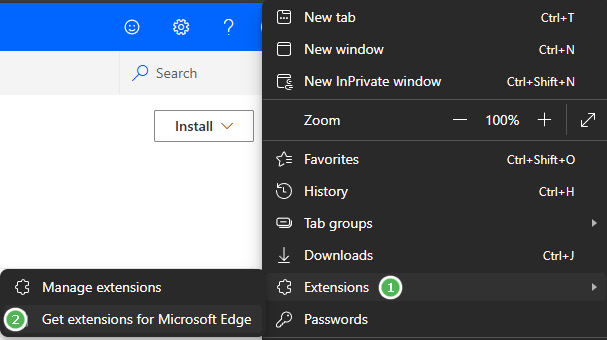

- Click on Extension
- Get extensions for Microsoft Edge
- Search for *Level Up*

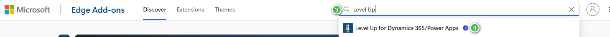

  and select Level Up for Dynamics 365 / Power Apps which will navigate you to the same page as the direct link above
  
- Click on the blue button *Get*
- Read the Notification / Warning that is displayed and decide if you want to add the extension to you browser. By clicking on *Add extension* you are granting the permissions displayed to this extension

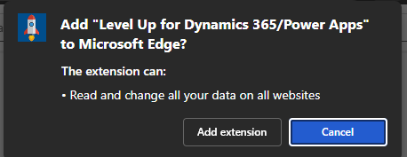

- After a few seconds the installation process of the browser extension is finished and a confirmation dialog is displayed

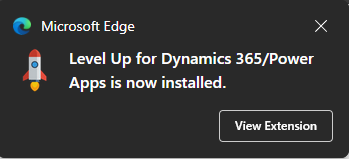

- Next click on *View Extension* and select to *Pin* the extension in the Browser menu bar

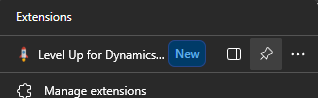

**Level Up has now been added succesfully to your edge browser**
2. Add the Custom Command

- Custom Commands are not available in the simple mode of Level Up which is opened by default when clicking on the small icon. You can either click on default at the buttom of the LEvel Up Screen or directly open the version by right-clicking on the icon and selecting *Open in Sidebar*

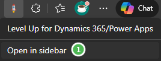

- If you are not logged in to a Model Driven App in your browser where you are opening Level up, you will see an error message:

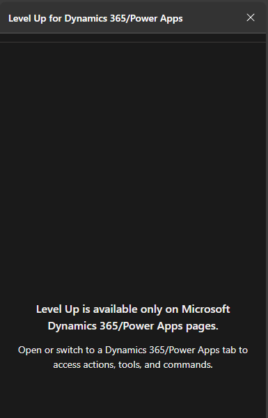

- Once you have opened a Model Driven App, the details of Level Up will be visible including the new section to add Commands, which will be empty if you have not installed some commands already.

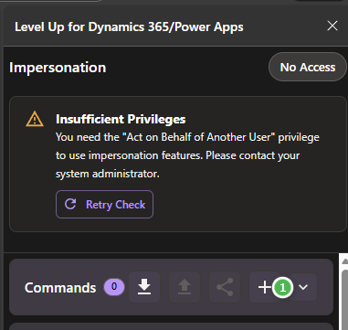

- Click on the **+** icon to add a new command
- In the following dialog either start creating your own command by using JS and the Dataverse XRM API or add the commands that are stored in this github repository or the official Level Up Community Commands repository mentioned below. In case you are trying outthe commands in this repository, please read the disclaimer below, as these are commands which have been vibe coded and which are not tested for production use. (More information below)
- If you are trying out these commands you first need to install the **Helper Overlay** which must be activated for each of my commands as I wanted to have a consistent design and functionality for the commands which I were creating for myself. Please note that there is always a full JS file which may be to large to use and then one version where the code has been minified. I am always using the minified version for my personal commands 

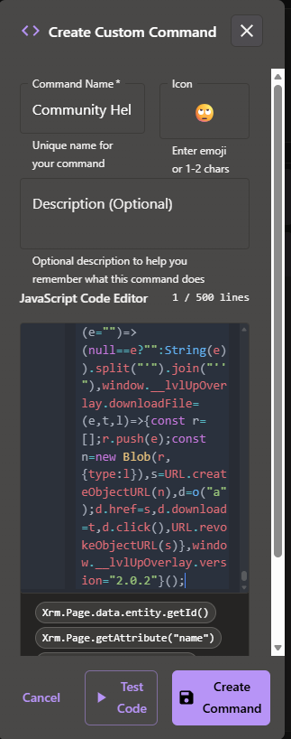

- Add a Command Name e.g. *Commuinty Helper*
- Add an Icon by clicking on "Win+." on a Windows PC and select the one that fits best for you
- Click on Create Command
- When you are Creating your own commands, or sometimes when work is in progress, you will see some warnings or error messages and the code in the JavaScript Editor is either underlined with red or you can see yellow lines besides the code. Then creating the Command is not possible and you have to solve the errors first (typically something like missing braces, missing parentheses, missing brackets, missing closing quotes etc. which can be pretty hard to find)
- Nevertheless, when everything is correct and Create Command is working for you, you will see the first Command button - Congratulations.

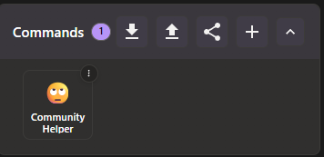

- In case you are using the command from this repository, clicking on the *Community Helper* Command wil just initialize the helper and you have to install the 2nd Command for the real Command 😉

3. Add the next Command *Field Focus*

- Follow the steps above and add a name, Icon, and the minified js to a 2nd command and click on Create Command

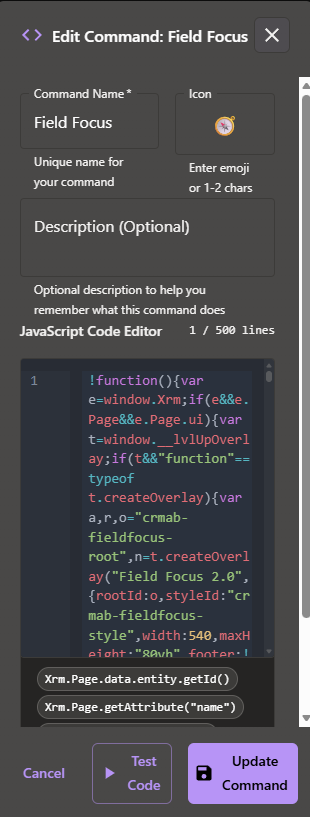

- Now you have two icons in your command palette

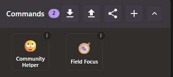

- Make sure that you are in a Model Driven App, in Form Context (not in a View or Dashboard etc., as this command will only help you on form level)
- Click on Field Focus (make sure that you had activated the helper first, otehrwise a message will appear, that the Helper Overlay is missing)
- Now the Field Focus 2.0 Command is visible in front of you form. This command will especially help you, when you have lots of fields on your form, hidden fields or tabs and you want to find a field quickly.
  - You can search for logical name or display name
  - You can switch between finding a field, or tab
  - in the list of field you will see, if the field or tab is currently visible or hidden, and you will already see the information on which tab and in which section a field is located
  - If you click on the field name in the Field Focus, the command will directly navigate you to the field, highlight the field and if hidden the field will be made visible

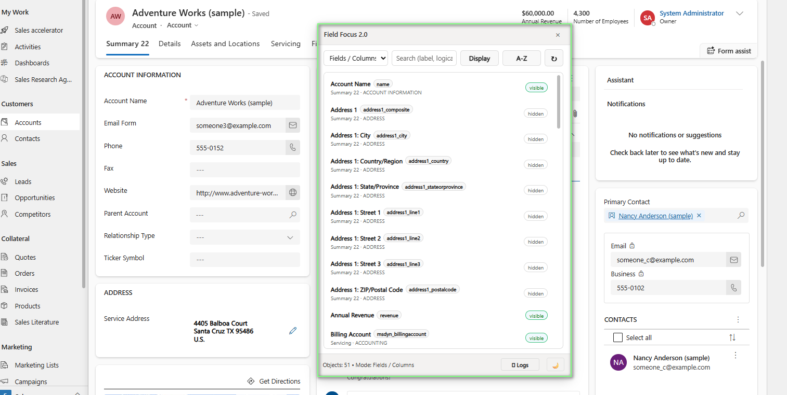

Please continue reading the diclaimer!

## Disclaimer & Scope

This repository contains custom **Level Up commands** (based on JavaScript) that are designed to be used **only as an extension to the "Level Up for Dynamics 365/Power Apps" browser extension in Microsoft Edge**.  
These commands are currently targeted and tested against **Level Up version 4.x** (Edge build released around August 2025). They are **not** intended for, nor tested with, earlier versions of Level Up or Level Up extensions in other browsers.

> ⚠️ You must have the official Level Up extension installed and enabled for these commands to work.

- Level Up for Dynamics 365/Power Apps on Microsoft Edge Add-ons:  
  <https://microsoftedge.microsoft.com/addons/detail/level-up-for-dynamics-365/mdjlgdkgmhlmcikdmeehcecolehipicf> by Natraj Yegnaraman

- Official Level Up source code:  
  <https://github.com/rajyraman/Levelup-for-Dynamics-CRM>

- Official Level Up community commands repository:  
  <https://github.com/rajyraman/level-up-community-commands>

All credit for the Level Up extension itself goes to **Natraj Yegnaraman** and the contributors of the above repositories. This project is **not affiliated with, endorsed by, or supported by** the Level Up author(s), Microsoft, or any employer.

---

## Purpose of These Commands

The commands in this repository are intended as **examples and ideas**. These represent some of the ideas regarding functionality that I personally missed in Level Up, Dynamics 365 or Power Platform in the last years and where I had not the time nor capability to build something on my own without availability of AI coding tools.

They are meant to:

- Show how Level Up commands can be extended or combined.
- Provide inspiration for your own custom commands.
- Encourage experimentation and community sharing of useful tooling.

They are **not** meant to be a finished product or an official toolkit.

---

## Use at Your Own Risk

Using the code in this repository is **entirely at your own risk**.

- **Always** review and understand the code before using it, especially in **project, customer, test, staging, UAT, or production environments**.
- You are responsible for ensuring that the commands comply with your organization’s security, compliance, data protection, and coding standards.
- If you are unsure whether a command is safe or appropriate for your environment, consult your security / compliance team before using it.

The code is provided **“as is”, without warranty of any kind**, express or implied, including but not limited to fitness for a particular purpose, non-infringement, and absence of defects or vulnerabilities.

---

## Development & AI-Assisted Code

These commands were created and refined using various tools, including but not limited to:

- Visual Studio Code (VS Code) and/or Cursor
- Personal AI coding assistants such as Codex by OpenAI, Claude Code or GitHub Copilot (Personal)
- Model Context Protocol (MCP) servers, e.g. the Microsoft Learn MCP

The use of AI tools means that parts of the code may have been generated, refactored, or suggested automatically. **No AI-generated code should be treated as production-ready without human review.** You should:

- Treat all code here as a starting point or template.
- Carefully verify logic, error handling, and performance for your specific scenarios.
- Adapt and harden the code before using it in critical or production environments.

---

## Testing Status & Limitations

Each command has been:

- Developed and iteratively refined based on my own usage.
- Tested by me in Dev environments.

However:

- The commands have **not** been formally verified, audited, or certified.
- Edge cases and specific organizational configurations may not be covered.
- Certain scenarios may result in **unexpected behavior, JavaScript errors, or failures**.

If you encounter issues, please consider opening an issue or pull request with details so that the commands can be improved over time.

---

## Command Layout & Overlay

For consistency, I have defined a **preferred layout and visual style** for the commands in this repository.

- I noticed that when “vibe coding” with AI tools, they tend to generate **inconsistent UI patterns and layouts**.
- To address this, I created a shared **overlay** (a base script/layout) that is **loaded first** and provides a consistent look & feel and certain shared utilities for all other commands.

If you reuse or extend these commands, you may want to either:

- Reuse the overlay to stay visually consistent, or  
- Replace it entirely with your own layout conventions.

---

## Community, Feedback & Contributions

I hope these commands:

- Inspire you to explore the **new command capabilities in Level Up v4**,
- Help you build and share your own ideas, and  
- Encourage more community contributions around Level Up and its command framework. I was happy to see that this capability has been added to Level Up. But currently there are no other commands shared in the official repository.

I am happy about:

- **Feedback** on where these commands can be improved or extended,
- **Bug reports** and hints about missing scenarios or edge cases,

---

## Legal Notice

This is a **personal free-time and community project**. It is:

- Provided as is and not officially maintained,
- Provided outside of any employment responsibilities,
- Not an official product of Microsoft, or any other organization.

By using any code, scripts, or assets from this repository, you agree that:

1. You do so **voluntarily and at your own risk**.  
2. You are solely responsible for testing, validating, and approving the code for your environment.  
3. Under no circumstances shall I be liable for any direct, indirect, incidental, special, exemplary, or consequential damages arising from the use of this repository or its contents.

This text is provided for informational purposes only and **does not constitute legal advice**. If you require a legally binding disclaimer or specific wording for your organization, please consult a qualified legal professional.
